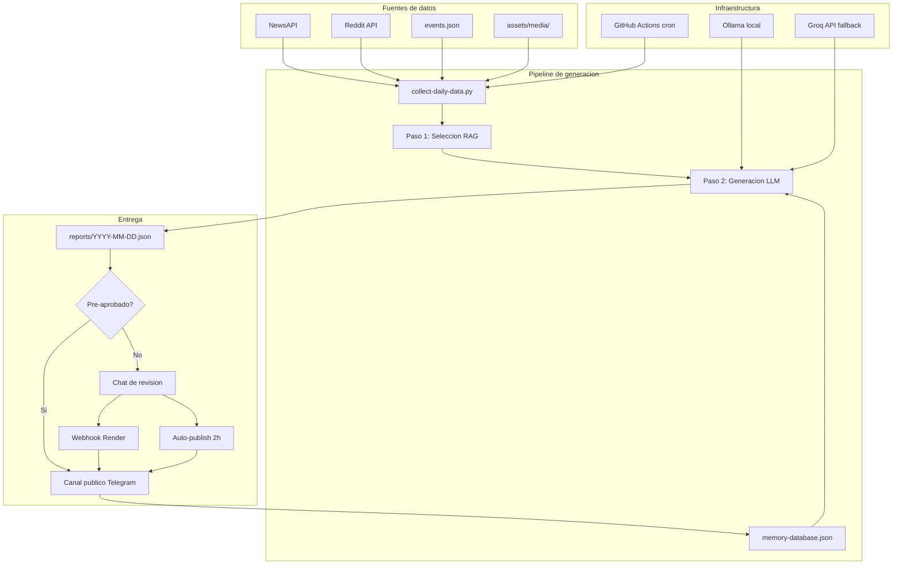
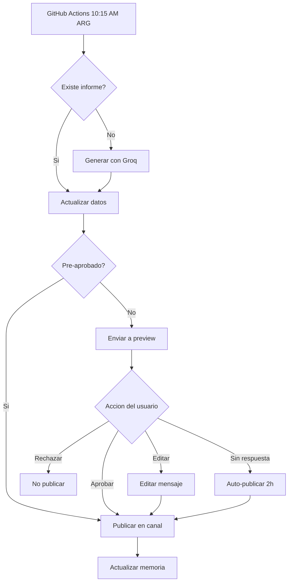

# InforMessi

Pipeline editorial automatizado que genera y publica mensajes diarios sobre la Selección Argentina y el Mundial 2026 en Telegram.

## Qué hace

1. **Recolecta datos**: eventos históricos, noticias (NewsAPI), Reddit, contenido audiovisual
2. **Genera mensajes**: LLM local (Ollama) o API externa (Groq) con prompts editoriales y sistema RAG anti-repetición
3. **Publica en Telegram**: flujo de revisión con aprobación manual, edición o publicación automática de respaldo
4. **Se ejecuta solo**: GitHub Actions corre el pipeline diariamente

## Stack

- **Python 3.12** — lenguaje principal
- **Ollama** — LLM local (qwen2.5:7b-instruct recomendado, llama3.2 mínimo)
- **Groq API** — fallback gratuito para GitHub Actions (sin Ollama)
- **Telegram Bot API** — publicación en canal/grupo
- **Flask + Render** — webhook para procesar aprobaciones
- **GitHub Actions** — ejecución diaria automatizada
- **NewsAPI + Reddit (PRAW)** — fuentes de noticias

## Inicio rápido

```bash
git clone <repo-url> && cd InforMessi
python3 -m venv venv && source venv/bin/activate
pip install -r requirements.txt

# Crear .env en la raíz con las variables de la sección "Configuración (.env)" abajo.
# Nunca subas .env ni .env.example con valores reales al repo (usa GitHub Secrets en CI).

ollama pull qwen2.5:7b-instruct  # o llama3.2

# Generar informes para los próximos 15 días
python3 scripts/generate-advance-reports.py --days 15

# Editar y pre-aprobar un informe
python3 scripts/edit-and-validate-report.py --date 2026-02-01

# Probar envío a Telegram
python3 scripts/send-daily-report-review.py
```

## Configuración (.env)

Crea un archivo `.env` en la raíz del proyecto con las variables siguientes. **No lo subas al repo**: está en `.gitignore`. En GitHub Actions usa Secrets; en local solo en tu máquina.

```env
# LLM
LLM_PROVIDER=ollama          # ollama o groq
LLM_MODEL=qwen2.5:7b-instruct
LLM_BASE_URL=http://localhost:11434
GROQ_API_KEY=                # solo si LLM_PROVIDER=groq

# Telegram
TELEGRAM_BOT_TOKEN=...
TELEGRAM_PREVIEW_CHAT_ID=... # chat privado para revisión
TELEGRAM_PUBLIC_CHAT_ID=...  # canal o grupo público

# Fuentes de datos
NEWSAPI_KEY=...
REDDIT_CLIENT_ID=...
REDDIT_CLIENT_SECRET=...
REDDIT_USER_AGENT=InforMessi/1.0
```

## Estructura del proyecto

```
InforMessi/
├── scripts/                        # Pipeline principal
│   ├── collect-daily-data.py       # Recolecta eventos + noticias del día
│   ├── generate-message.py         # Genera mensaje con LLM (2 pasos RAG)
│   ├── generate-advance-reports.py # Genera borradores para N días
│   ├── update-today-report.py      # Actualiza informe del día con datos frescos
│   ├── send-daily-report-review.py # Envía a preview o publica si pre-aprobado
│   ├── auto-publish-fallback.py    # Publica si no hay respuesta en 2h
│   ├── publish-approved-report.py  # Publica manualmente un informe
│   ├── edit-and-validate-report.py # Editar y pre-aprobar informes
│   ├── webhook-server.py          # Servidor Flask para callbacks de Telegram
│   ├── fetch-news.py              # NewsAPI + RSS + scraping
│   ├── fetch-reddit.py            # Reddit scraper
│   ├── fetch-events-enhanced.py   # Eventos desde JSON + Wikipedia + calendario
│   ├── rag_memory_database.py     # Base de datos de memoria anti-repetición
│   ├── rag_style_learning.py      # RAG de estilo desde informes editados
│   ├── generate-weekly-sections.py # Secciones temáticas por día de semana
│   ├── detect-media.py            # Detecta contenido audiovisual por fecha
│   ├── diagnose-workflow.py       # Diagnóstico de configuración
│   └── verify-bot-token.py        # Verifica token de Telegram
│
├── prompts/                       # Prompts del LLM
│   ├── system-prompt.md           # Identidad editorial
│   ├── main-editorial.md          # Estructura y reglas del mensaje
│   ├── selection-prompt.md        # Paso 1 RAG: selección de evidencias
│   ├── constraints.md             # Restricciones adicionales
│   └── examples.md                # Ejemplos de salida
│
├── data/
│   ├── events.json                # Eventos históricos y cumpleaños
│   ├── players.json               # Datos de jugadores
│   ├── templates.json             # Templates de mensajes
│   └── memory-database.json       # BD persistente de contenido usado
│
├── reports/                       # Un JSON por día (draft → updated → published)
├── assets/media/                  # Contenido audiovisual por fecha
├── .github/workflows/
│   └── daily-informessi.yml       # Cron diario 10:15 AM Argentina
└── docs/                          # Documentación detallada
```

## Arquitectura



## Flujo diario



## Generación de mensajes (RAG en 2 pasos)

1. **Selección**: el LLM recibe todos los eventos/noticias del día y elige los más relevantes (JSON estricto)
2. **Generación**: el LLM genera el mensaje usando solo los items seleccionados, el contexto de memoria (para evitar repeticiones) y el estilo aprendido de informes anteriores

Si no hay eventos ni noticias, el paso de selección se omite y el LLM genera solo saludo + cuenta regresiva + cierre.

## Scripts útiles

```bash
# Generar informes anticipados (sin noticias, solo eventos)
python3 scripts/generate-advance-reports.py --days 15

# Actualizar informe del día con noticias frescas
python3 scripts/update-today-report.py

# Editar y pre-aprobar un informe
python3 scripts/edit-and-validate-report.py --date 2026-02-01

# Enviar informe a Telegram (preview o directo)
python3 scripts/send-daily-report-review.py

# Ver base de datos de memoria
python3 scripts/rag_memory_database.py --show

# Verificar configuración de Telegram
python3 scripts/diagnose-workflow.py

# Recolectar datos para una fecha sin noticias
python3 scripts/collect-daily-data.py --date 2026-02-01 --output tmp/data.json --no-news
```

## Agregar contenido

### Eventos (`data/events.json`)

```json
{
  "date": "1978-06-25",
  "type": "title",
  "priority": "high",
  "person": "Daniel Passarella",
  "description": "Argentina Campeón del Mundo por primera vez (3-1 vs Holanda)."
}
```

Los eventos se matchean por **mes y día** (no por año), así los aniversarios aparecen automáticamente cada año.

Tipos: `birthday`, `match`, `title`, `world_cup`, `record`, `debut`, `historical`

### Contenido audiovisual (`assets/media/`)

Crear carpeta `assets/media/YYYY-MM-DD/` con imágenes o videos. Se detectan automáticamente.

## Secciones semanales

- **Lunes/Viernes**: Selección Argentina en Mundiales
- **Martes/Jueves**: Jugador de la Scaloneta
- **Sábado**: Dato Mundialista
- **Domingo**: Dato del País Sede
- **Miércoles**: Formato estándar

## Tests

```bash
python3 -m pytest tests/ -v
```

43 tests unitarios cubren:
- Calculo de dias restantes al Mundial
- Parseo de seleccion RAG (JSON extraction, fallback, edge cases)
- Formateo de eventos y noticias para prompts
- Base de datos de memoria (normalizacion, deduplicacion, analisis de reportes)
- Calculo dinamico de edad en cumpleanos
- Match de eventos por MM-DD

## Lecciones aprendidas

- **LLMs pequenos (3B) no siguen instrucciones complejas**: llama3.2 (3B) ignora restricciones del system prompt, alucina noticias y revierte a tono de "asistente". Modelos de 7B+ (qwen2.5, llama3.1) son significativamente mejores para seguir formatos estrictos.

- **Sin datos concretos, el LLM inventa**: la solucion fue no llamar al LLM cuando no hay eventos ni noticias, en vez de confiar en que "no invente". Esto elimino el 100% de las alucinaciones en reportes anticipados.

- **RAG en 2 pasos funciona mejor que un prompt unico**: separar seleccion (JSON estricto, baja temperatura) de generacion (texto libre, temperatura normal) fuerza al modelo a comprometerse con datos especificos antes de escribir.

- **La memoria debe actualizarse solo al publicar**: actualizar la base de datos de memoria con drafts contaminaba el historial. Ahora solo se registra contenido que efectivamente se publico.

- **El error swallowing en CI oculta fallas criticas**: usar `|| echo "error"` en GitHub Actions hacia que todo pareciera funcionar cuando en realidad los scripts fallaban silenciosamente. Los scripts criticos ahora fallan el workflow para visibilizar problemas.

- **Los eventos historicos necesitan match por MM-DD, no por fecha completa**: matchear por `YYYY-MM-DD` excluia aniversarios. Matchear solo por `MM-DD` permite que eventos de 1978 aparezcan cada 25 de junio.

## Troubleshooting

| Problema | Solución |
|----------|----------|
| Ollama no conecta | `ollama serve` y verificar `LLM_BASE_URL` en `.env` |
| Mensajes genéricos/inventados | Verificar que hay eventos o noticias. Sin datos, el LLM genera solo saludo + cierre |
| Botones de Telegram no responden | Verificar webhook: `python3 scripts/setup-webhook.py --info` |
| GitHub Actions no genera mensaje | Configurar `GROQ_API_KEY` en GitHub Secrets |
| Noticias repetidas | Ejecutar `python3 scripts/rag_memory_database.py --show` para ver historial |

## Documentación adicional

- `docs/guia-agregar-contenido.md` — cómo agregar eventos y media
- `docs/guia-pre-aprobacion.md` — flujo de edición y pre-aprobación
- `docs/github-actions-setup.md` — configuración de GitHub Actions
- `docs/guia-render-setup.md` — deploy del webhook en Render
- `docs/sistema-memoria-rag.md` — cómo funciona la memoria anti-repetición
- `docs/formato-eventos.md` — schema de `events.json`

---

*Coronados de gloria vivamos* 🇦🇷
