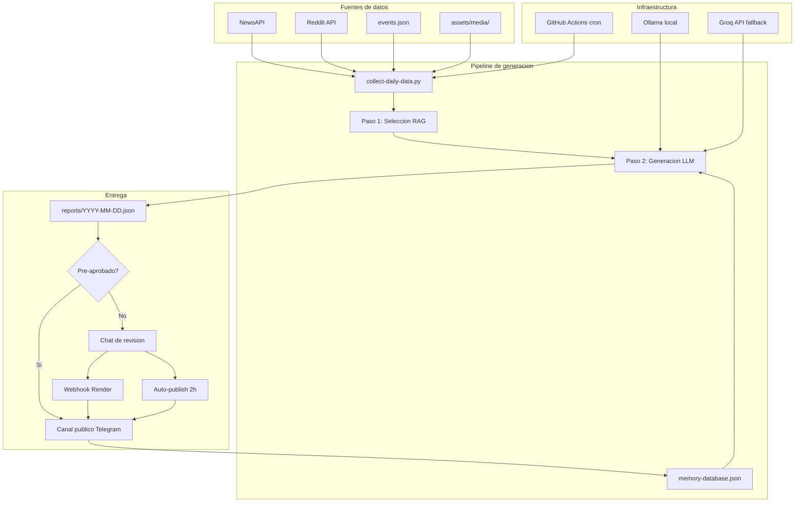

# Arquitectura del Sistema - InforMessi

## Vision General

InforMessi es un pipeline editorial automatizado con humano en el loop. Genera mensajes diarios sobre la Seleccion Argentina y el Mundial 2026, con revision humana antes de publicar en Telegram.

## Stack Tecnologico

- **Python 3.12** — lenguaje principal, scripts modulares
- **Ollama / Groq API** — generacion de texto con LLM (local o cloud)
- **Telegram Bot API** — preview privado + publicacion al canal
- **Flask + Render** — webhook para callbacks de aprobacion
- **GitHub Actions** — cron diario, CI/CD automatizado
- **NewsAPI + Reddit (PRAW) + RSS** — fuentes de datos

## Diagrama de Flujo

## Componentes Principales

### 1. Recoleccion de Datos (collect-daily-data.py)

Agrega eventos historicos desde JSON curado, noticias frescas via NewsAPI y RSS, y contenido de Reddit. Filtra noticias repetidas usando la base de datos de memoria.

### 2. Generacion en 2 Pasos (generate-message.py)

- **Paso 1 - Seleccion**: El LLM recibe todos los eventos/noticias y selecciona los mas relevantes (JSON estricto, temperatura baja).
- **Paso 2 - Generacion**: Con los items seleccionados, contexto de memoria anti-repeticion, estilo aprendido de reportes anteriores y seccion semanal tematica, el LLM genera el mensaje editorial.

### 3. Sistema de Memoria (rag_memory_database.py)

Base de datos JSON persistente que rastrea jugadores mencionados, noticias usadas, secciones semanales y temas tratados. Se actualiza solo al publicar para evitar contaminacion con drafts.

### 4. Aprendizaje de Estilo (rag_style_learning.py)

Extrae snippets de reportes editados/publicados para inyectar como few-shot examples en el prompt, logrando consistencia de tono editorial.

### 5. Entrega y Revision Humana

- Preview en Telegram con botones (Aprobar / Editar / Rechazar)
- Webhook en Render procesa la decision
- Auto-publicacion a las 2 horas si no hay respuesta
- Memoria se actualiza solo tras publicacion efectiva

### 6. Guardrails Anti-Alucinacion

- Post-procesamiento regex para detectar anos, scores y nombres no presentes en los datos de entrada
- Skip de generacion LLM cuando no hay datos (evita invenciones)
- Cierre ritual forzado ("Coronados de gloria vivamos")
- Mensaje seguro de fallback si el LLM agrega contenido no solicitado

## Infraestructura

### GitHub Actions
- Cron diario a las 10:15 AM Argentina (13:15 UTC)
- Usa Groq API como LLM (no requiere Ollama en CI)
- Commitea reportes y datos actualizados al repositorio

### Render
- Servidor Flask que recibe webhooks de Telegram
- Procesa aprobaciones, ediciones y rechazos

## Seguridad

- Secrets en variables de entorno (.env local, GitHub Secrets en CI)
- Ningun archivo .env se commitea al repositorio
- LLM local (Ollama) mantiene datos en el servidor del desarrollador
