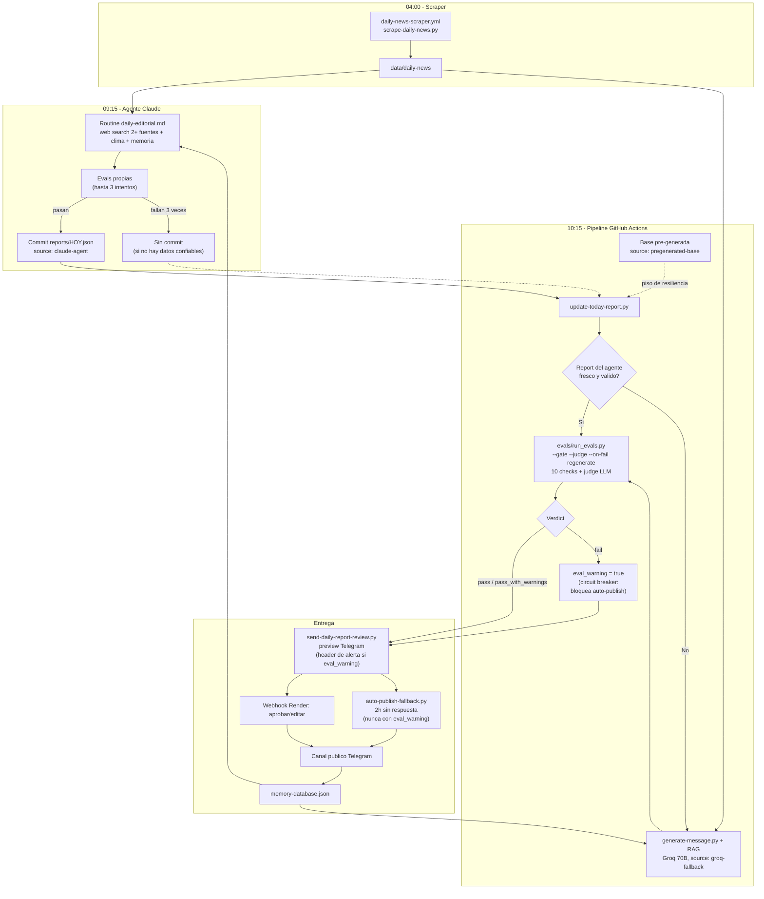

# Arquitectura del Sistema - InforMessi

## Vision General

InforMessi es un pipeline editorial automatizado con humano en el loop. Genera mensajes diarios sobre la Seleccion Argentina y el Mundial 2026, con un gate de evals (checks programaticos + LLM-as-judge) y revision humana antes de publicar en Telegram.

La arquitectura es hibrida y separa generacion de evaluacion: hay hasta **tres fuentes de generacion** (agente Claude con web search, fallback Groq 70B, base pre-generada) y todas pasan por **el mismo gate de calidad** (`evals/run_evals.py`). La teoria detras de cada patron esta en [ai-engineering.md](ai-engineering.md); el contrato agente-pipeline en [agente-diario.md](agente-diario.md).

## Stack Tecnologico

- **Python 3.12** — lenguaje principal, scripts modulares
- **Claude Code scheduled agent** — generacion principal con web search (routine `.claude/routines/daily-editorial.md`)
- **Groq API (llama-3.3-70b-versatile)** — fallback de generacion + modelo del judge
- **Ollama** — LLM local opcional para desarrollo
- **Evals propias** — `evals/checks.py` (10 checks), `evals/judge.py` (LLM-as-judge), `evals/run_evals.py` (orquestador/gate)
- **Telegram Bot API** — preview privado + publicacion al canal
- **Flask + Render** — webhook para callbacks de aprobacion
- **GitHub Actions** — scraper 04:00 AR + pipeline diario 10:15 AR
- **NewsAPI + Reddit (PRAW) + RSS + Open-Meteo** — fuentes de datos

## Diagrama de Flujo

Horarios en hora Argentina (UTC-3):

## Componentes Principales

### 0. Agente editorial (`.claude/routines/daily-editorial.md`)

Scheduled agent de Claude Code que corre en cloud a las 09:15 AR. Lee la guia editorial, busca en la web partidos/resultados/noticias del dia (cada dato confirmado en al menos 2 fuentes independientes), obtiene el clima con `fetch-weather.py`, consulta la memoria anti-repeticion, redacta el mensaje, corre las evals localmente (hasta 3 intentos de correccion) y commitea `reports/HOY.json` con `source: claude-agent`. Si no consigue datos confiables o las evals no pasan, no commitea nada: el pipeline de las 10:15 genera el fallback. Contrato completo en [agente-diario.md](agente-diario.md).

### 1. Recoleccion de Datos (collect-daily-data.py)

Agrega eventos historicos desde JSON curado, noticias frescas via NewsAPI y RSS, contenido de Reddit y clima de Open-Meteo. Filtra noticias repetidas usando la base de datos de memoria. El scraper de las 04:00 AR (`daily-news-scraper.yml`) deja las noticias del dia listas en `data/daily-news`.

### 2. Generacion en 2 Pasos (generate-message.py)

- **Paso 1 - Seleccion**: El LLM recibe todos los eventos/noticias y selecciona los mas relevantes (JSON estricto, temperatura baja).
- **Paso 2 - Generacion**: Con los items seleccionados, contexto de memoria anti-repeticion, estilo aprendido de reportes anteriores y seccion semanal tematica, el LLM genera el mensaje editorial.

### 3. Sistema de Memoria (rag_memory_database.py)

Base de datos JSON persistente que rastrea jugadores mencionados, noticias usadas, secciones semanales y temas tratados. Se actualiza solo al publicar para evitar contaminacion con drafts.

### 4. Aprendizaje de Estilo (rag_style_learning.py)

Extrae snippets de reportes editados/publicados para inyectar como few-shot examples en el prompt, logrando consistencia de tono editorial.

### 5. Gate de Evals (evals/)

Todo mensaje —venga del agente, de Groq o de la base pre-generada— pasa por `evals/run_evals.py --gate --judge --on-fail regenerate` antes de la entrega:

- **`evals/checks.py`**: 10 checks programaticos derivados de `docs/editorial-guide.md` (saludo, countdown, clima, placeholders, cierre ritual, anos grounded, fecha, longitud, markdown, emojis), con severidades `error` (bloquea) y `warning` (informa).
- **`evals/judge.py`**: LLM-as-judge con Groq 70B, temperatura 0, JSON mode, rubrica 1-5 en 4 dimensiones (tono, estructura, fidelidad_guia, factualidad_aparente), evaluando contra las fuentes provistas. Promedio < 3.0 fuerza `fail`.
- **Verdict**: `pass` / `pass_with_warnings` / `fail`. Ante `fail` se intenta una regeneracion; si persiste, el report queda con `eval_warning: true` y `pre_approved: false` (circuit breaker).
- Cada corrida se registra en `data/eval-history.json` (verdict + scores por fecha y `source`), lo que permite comparar la calidad de las tres fuentes de generacion en el tiempo.

### 6. Entrega y Revision Humana

- Preview en Telegram con botones (Aprobar / Editar / Rechazar); si hay `eval_warning`, el preview lleva un header de advertencia con los checks fallidos
- Webhook en Render procesa la decision
- Auto-publicacion a las 2 horas si no hay respuesta (`auto-publish-fallback.py`) — **nunca** si el report tiene `eval_warning`: ese dia exige edicion + aprobacion manual
- Memoria se actualiza solo tras publicacion efectiva

### 7. Guardrails Anti-Alucinacion

- Bloque de clima 100% deterministico: el LLM tiene prohibido escribir temperaturas; el bloque lo construye `fetch-weather.py` y lo inyecta el post-proceso
- Post-procesamiento regex para detectar anos, scores y nombres no presentes en los datos de entrada (whitelist de entidades)
- Skip de generacion LLM cuando no hay datos (evita invenciones)
- Cierre ritual forzado ("Coronados de gloria vivamos")
- Mensaje seguro de fallback si el LLM agrega contenido no solicitado
- Verificacion multi-fuente (2+) en la busqueda web del agente

Detalle de la jerarquia de grounding en [ai-engineering.md](ai-engineering.md#4-grounding-y-anti-alucinación).

## Infraestructura

### GitHub Actions
- Scraper de noticias: cron 04:00 AM Argentina (07:00 UTC, `daily-news-scraper.yml`)
- Pipeline diario: cron 10:15 AM Argentina (13:15 UTC, `daily-informessi.yml`)
- Usa Groq API como LLM (no requiere Ollama en CI)
- Commitea reportes y datos actualizados al repositorio (con `git pull --rebase` previo para evitar carreras con los commits del agente/scraper)

### Routine cloud (Claude Code)
- Agente programado a las 09:15 AM Argentina (12:15 UTC), ~1 hora antes del pipeline para dar margen a reintentos

### Render
- Servidor Flask que recibe webhooks de Telegram
- Procesa aprobaciones, ediciones y rechazos

## Seguridad

- Secrets en variables de entorno (.env local, GitHub Secrets en CI)
- Ningun archivo .env se commitea al repositorio
- LLM local (Ollama) mantiene datos en el servidor del desarrollador
