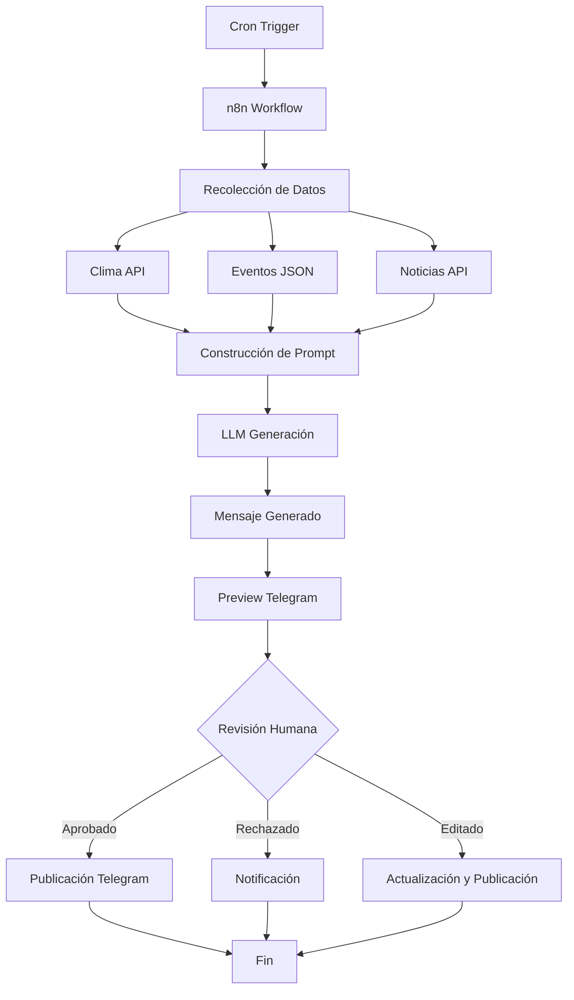

# Arquitectura del Sistema - InforMessi

## Visión General

InforMessi es un pipeline editorial automatizado con humano en el loop. El sistema genera mensajes informativos diarios sobre el Mundial de Fútbol 2026, pero requiere aprobación humana antes de publicar.

## Diagrama de Flujo

## Componentes Principales

### 1. Orquestación (n8n)

- **Rol**: Coordinar todo el flujo
- **Responsabilidades**:
  - Trigger diario (cron)
  - Recolección de datos
  - Construcción de prompts
  - Llamadas a LLM
  - Gestión de preview y aprobación
  - Publicación final

### 2. Generación de Contenido (LLM)

- **Rol**: Redactor editorial
- **Tecnología**: Modelo local (Ollama u otro)
- **Inputs**:
  - System prompt (identidad editorial)
  - Main prompt (estructura del día)
  - Datos del día (clima, eventos, noticias)
- **Output**: Mensaje formateado (90-130 palabras)

### 3. Recolección de Datos

#### Clima
- **Fuente**: API de clima (OpenWeatherMap u otro)
- **Datos**: Temperatura min/max para AMBA y La Plata
- **Frecuencia**: Diaria

#### Eventos
- **Fuente**: Archivo JSON estructurado (`data/events.json`)
- **Tipos**: Cumpleaños, partidos, anuncios, fechas patrias
- **Priorización**: Crítica, alta, media, baja

#### Noticias
- **Fuente**: API de noticias deportivas (Fase 4)
- **Filtros**: Solo noticias relevantes (selección argentina, Mundial)
- **Frecuencia**: Diaria

### 4. Revisión Humana

- **Canal**: Telegram privado o Notion
- **Proceso**:
  1. Preview del mensaje generado
  2. Opción de aprobar, rechazar o editar
  3. Si se edita, actualización y publicación
- **Tiempo**: Sin límite (pero workflow espera respuesta)

### 5. Publicación

- **Canales**:
  - Telegram (principal)
  - X / Twitter (adaptado)
  - Instagram (adaptado)
- **Formato**: Texto plano, con imagen opcional

## Flujo Detallado

### Paso 1: Trigger Diario
- Cron configurado en n8n
- Ejecuta diariamente a hora fija (ej: 8:00 AM ARG)

### Paso 2: Recolección
- Paralelo:
  - Consulta API de clima
  - Lee eventos del día desde JSON
  - Consulta noticias relevantes (si hay API)

### Paso 3: Construcción de Prompt
- Combina:
  - System prompt (identidad)
  - Main prompt (estructura)
  - Datos del día (clima, eventos, noticias)
  - Ejemplos (opcional, para few-shot)

### Paso 4: Generación
- Llamada a LLM local
- Parámetros:
  - Modelo: Configurado en .env
  - Temperature: Baja (para consistencia)
  - Max tokens: ~200 (para controlar longitud)

### Paso 5: Preview
- Envío a Telegram (canal privado)
- Formato: Mensaje + opciones (Aprobar/Rechazar/Editar)
- Espera respuesta humana

### Paso 6: Decisión
- **Aprobar**: Publica directamente
- **Rechazar**: Notifica y termina
- **Editar**: Permite modificación manual, luego publica

### Paso 7: Publicación
- Envío a canal público de Telegram
- Opcional: Adaptación para otras plataformas

## Human in the Loop

### ¿Por qué es crítico?

1. **Control editorial**: Mantener calidad y coherencia
2. **Prevención de errores**: Evitar datos inventados o contenido inapropiado
3. **Flexibilidad**: Permitir ajustes según contexto
4. **Responsabilidad**: El contenido publicado tiene supervisión humana

### Implementación

- **Canal de preview**: Telegram bot con botones interactivos
- **Tiempo de espera**: Sin límite (pero puede configurarse timeout)
- **Edición**: Manual en Telegram o Notion, luego re-publicación

## Escalabilidad

### Fase Actual (MVP)
- Datos mock
- LLM local
- Telegram único

### Fase Futura
- APIs reales
- Múltiples canales
- Análisis de engagement
- A/B testing de mensajes

## Seguridad y Privacidad

- **Tokens**: En variables de entorno (.env)
- **Datos sensibles**: No se almacenan en repo
- **LLM local**: Datos no salen del servidor
- **Preview privado**: Solo accesible para revisión

## Monitoreo y Logs

- **n8n**: Logs de ejecución de workflows
- **LLM**: Logs de generación (opcional)
- **Telegram**: Historial de mensajes
- **Errores**: Notificaciones en canal de errores

## Próximos Pasos Técnicos

1. Implementar workflow básico en n8n
2. Configurar LLM local
3. Crear sistema de preview en Telegram
4. Integrar APIs reales (Fase 4)
5. Agregar visuales (Fase 5)

---

*Documentación actualizada en Fase 0*

